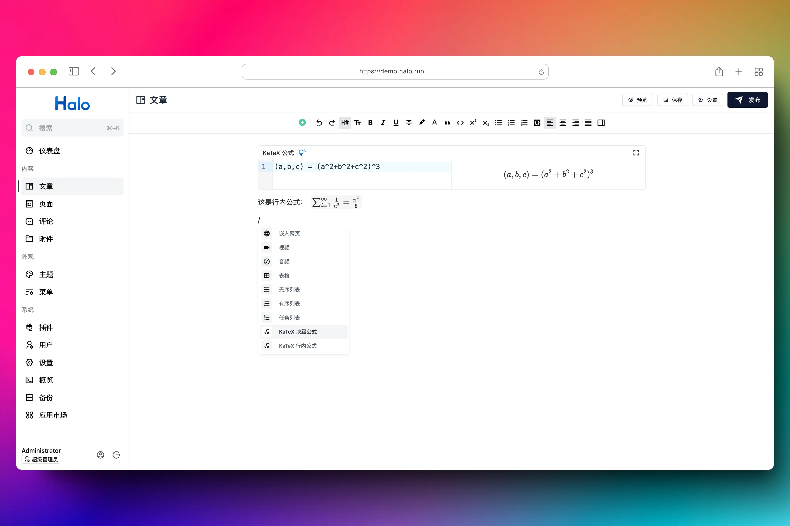

# plugin-katex

为默认编辑器和文章渲染提供 KaTeX 支持。



## 使用方式

1. 下载，目前提供以下两个下载方式：
    - GitHub Releases：访问 [Releases](https://github.com/halo-sigs/plugin-katex/releases) 下载 Assets 中的 JAR 文件。
    - Halo 应用市场：<https://halo.run/store/apps/app-ISCsX>。
2. 安装，插件安装和更新方式可参考：<https://docs.halo.run/user-guide/plugins>。

## 用法说明

### 在默认编辑器中使用

1. 方式一：在默认编辑器中，使用 `$` 开头和结尾的语句将会被渲染为 KaTeX 行内公式，输入 `$$` 并回车可以插入 KaTeX 块级公式。
2. 方式二：在编辑器顶部工具栏的工具箱中点击 **KaTeX 块级公式** 或者 **KaTeX 行内公式** 即可插入块级公式和行内公式。
3. 方式三：在指令菜单（/）中选择 **KaTeX 块级公式** 或者 **KaTeX 行内公式** 即可插入块级公式和行内公式。

在默认编辑器中使用，编辑器将会自动生成相应的 DOM 结构，无需进行其他配置。

### 在非默认编辑器中使用

在非默认编辑器中使用时，需要前往插件的设置页面，启用 KaTex 前端渲染，插件支持 2 个配置项。

1. 行内公式 CSS 选择器

    CSS Selector 语法，用来查找渲染的行内公式 Dom。

    默认值为：`[math-inline]`，根据实际所使用的编辑器设置为相应的 Selector 即可。

    已知编辑器:

    [ByteMD](https://www.halo.run/store/apps/app-HTyhC)：`.math-inline`

    [StackEdit](https://www.halo.run/store/apps/app-hDXMG)：`.katex--inline`

    如同时使用多个编辑器，CSS Selector 之间用 `,` 隔开即可。

    如：`[math-inline],.math-inline,.katex--inline`

2. 块级公式 CSS 选择器

    CSS Selector 语法，用来查找渲染的块级公式 Dom。

    默认值为：`[math-display]`，根据实际所使用的编辑器设置为相应的 Selector 即可。

    已知编辑器:

    [ByteMD](https://www.halo.run/store/apps/app-HTyhC)：`.math-display`

    [StackEdit](https://www.halo.run/store/apps/app-hDXMG)：`.katex--display`

## 开发环境

```bash
git clone git@github.com:halo-sigs/plugin-katex.git

# 或者当你 fork 之后

git clone git@github.com:{your_github_id}/plugin-katex.git
```

```bash
cd path/to/plugin-katex
```

```bash
# macOS / Linux
./gradlew pnpmInstall

# Windows
./gradlew.bat pnpmInstall
```

### 使用 Halo Server 运行（需 Docker 环境）

```bash
# macOS / Linux
./gradlew haloServer

# Windows
./gradlew.bat haloServer
```

### 使用 Halo Dev 运行

```bash
# macOS / Linux
./gradlew build

# Windows
./gradlew.bat build
```

修改 Halo 配置文件：

```yaml
halo:
    plugin:
        runtime-mode: development
        classes-directories:
            - "build/classes"
            - "build/resources"
        lib-directories:
            - "libs"
        fixedPluginPath:
            - "/path/to/plugin-katex"
```
